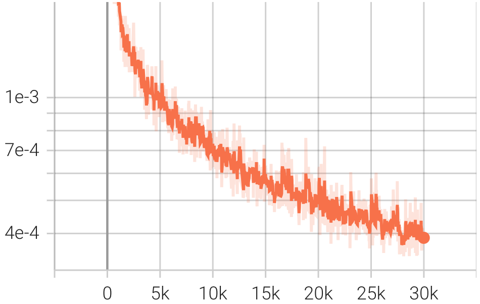

# Hands-On NeRF with KAN

[KAN: Kolmogorov-Arnold Networks](https://arxiv.org/abs/2404.19756) is a promising challenger to traditional MLPs. We're thrilled about integrating KAN into [NeRF](https://www.matthewtancik.com/nerf)! Is KAN suited for **view synthesis** tasks? What challenges will we face? How will we tackle them? We provide our initial observations and future discussion!

<div style="text-align:center;">
  <video src="asset/main.mp4" width="640" height="360" controls>
    Your browser does not support the video tag.
  </video>
</div>

# Installation

KANeRF is buid based on [nerfstudio](https://docs.nerf.studio/quickstart/installation.html#) and [kan](https://kindxiaoming.github.io/pykan/).  Please refer to the website for detailed installation instructions if you encounter any problems.

```bash
# create python env
conda create --name nerfstudio -y python=3.8
conda activate nerfstudio
python -m pip install --upgrade pip

# install torch
pip install torch==2.1.2+cu118 torchvision==0.16.2+cu118 --extra-index-url https://download.pytorch.org/whl/cu118
conda install -c "nvidia/label/cuda-11.8.0" cuda-toolkit

# install tinycudann
pip install ninja git+https://github.com/NVlabs/tiny-cuda-nn/#subdirectory=bindings/torch

# install nerfstudio
pip install nerfstudio

# install KAN
pip install pykan
```

# Performance Comparision

We integrate KAN and [NeRFacto](https://docs.nerf.studio/nerfology/methods/nerfacto.html), and compare KANeRF with NeRFacto in terms of model parameters, training time, novel view synthesis performance, etc. on the [Blender dataset](https://github.com/bmild/nerf?tab=readme-ov-file#project-page--video--paper--data). Under the same network settings, KAN achieves superior performance in novel view synthesis compared to MLP, suggesting that KAN possesses a more powerful fitting capability. However, KAN's inference and training processes are significantly slower than those of MLP. Furthermore, with a comparable number of parameters, KAN underperforms MLP.

| Model                         | NeRFacto                                                                          | NeRFacto Tiny                                                                          | KANeRF                                                                          |
| ----------------------------- | --------------------------------------------------------------------------------- | -------------------------------------------------------------------------------------- | ------------------------------------------------------------------------------- |
| Trainable Network Parameters  | 8192                                                                              | 2176                                                                                   | 7131                                                                            |
| Total Network Parameters      | 8192                                                                              | 2176                                                                                   | 10683                                                                           |
| hidden_dim                    | 64                                                                                | 8                                                                                      | 8                                                                               |
| hidden_dim_color              | 64                                                                                | 8                                                                                      | 8                                                                               |
| num_layers                    | 2                                                                                 | 1                                                                                      | 1                                                                               |
| num_layers_color              | 2                                                                                 | 1                                                                                      | 1                                                                               |
| geo_feat_dim                  | 15                                                                                | 7                                                                                      | 7                                                                               |
| appearance_embed_dim          | 32                                                                                | 8                                                                                      | 8                                                                               |
| Training Time                 | 14m 13s                                                                           | 13m 47s                                                                                | 9h 49m 44s                                                                      |
| FPS                           | 2.5                                                                               | ~2.5                                                                                   | 0.02                                                                            |
| LPIPS                         | 0.0132                                                                            | 0.0186                                                                                 | 0.0154                                                                          |
| PSNR                          | 33.69                                                                             | 32.67                                                                                  | 33.10                                                                           |
| SSIM                          | 0.973                                                                             | 0.962                                                                                  | 0.966                                                                           |
| Loss                          |                                                      |                                                    |                                                      |
| reconstruction result (rgb)   | <video src="asset/nerfacto_rgb.mp4" width="512" height="512" controls>.</video>   | <video src="asset/nerfacto_tiny_rgb.mp4" width="512" height="512" controls>.</video>   | <video src="asset/kanerf_rgb.mp4" width="512" height="512" controls>.</video>   |
| reconstruction result (depth) | <video src="asset/nerfacto_depth.mp4" width="512" height="512" controls>.</video> | <video src="asset/nerfacto_tiny_depth.mp4" width="512" height="512" controls>.</video> | <video src="asset/kanerf_depth.mp4" width="512" height="512" controls>.</video> |

KAN has potential for optimization, particularly with regard to accelerating its inference speed. We plane to develop a CUDA-accelerated version of KAN to further enhance its performance :D

* The Visulization of KanNeRF


<div style="text-align:center;">
  
</div>

## Contact us

```bibtex
@Manual{,
   title = {Hands-On NeRF with KAN},
   author = {Delin Qu, Qizhi Chen},
   year = {2024},
   url = {https://github.com/Tavish9/KANeRF},
 }
```